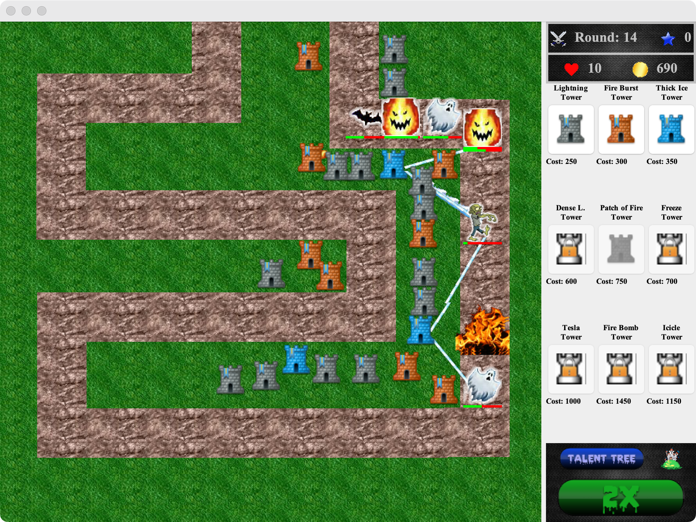

# Halloween Tower Defense Game

This repo contains the code for a Halloween themed Tower Defense game which was developed for our Human Computer Interaction class project.

<!-- TODO Add Github username and links -->
The code was written by Ali Hajimirza, Logan Testi, and Reggie Renteria

## Game Features

 <!-- TODO  Add description about the game features-->

## Getting started

### Playing the game

<!-- TODO -->
We are going to add downloadable jar files from github releases

### Development

- Java Development Kit 7 or above
- Gradle
- IntelliJ, Eclipse, or other IDEs (optional)

## Structure

halloween-tower-defense
.
├── LICENSE
├── README.md
├── config
├── gradle
├── docs
└── app/src
    ├── test
        ├── resources
        └── java/com/halloween_tower_defense
            └──
    └── main
        ├── resources
            └── resources
        └── java/com/halloween_tower_defense
            ├── app.java
            ├── controllers
            ├── mapdata
            ├── mobs
            ├── models
            ├── projectiles
            ├── towers
            ├── utilities
            └── views

# Image References

We did not have time during the semester to make our own custom artwork. Here are the links to the images that we used for this project:

- [Main Screen Image](http://blog.bioware.com/wp-content/uploads/2012/10/HalloweenPromo.jpg)
- [Background Image](http://www.finewallpaperss.com/wp-content/uploads/2012/10/halloween.jpg)
- [Talent Tree Image](http://image.yaymicro.com/rz_512x512/0/56a/fairy-tale-castle-56a481.jpg)
- [Game Icons](http://www.sc2mapster.com/media/images/48/16/WoW_Icons.jpg)

## Issues or questions

If you encounter any problems or have any question, please [file an issue].

## Contributing

We welcome contributions to this project. Please refer to the [CONTRIBUTING] to get started.

## Code of Conduct

Everyone interacting in this project's codebases, issue trackers,
chat rooms, and mailing lists is expected to follow the [CODE_OF_CONDUCT]

## License

[MIT License]

[![OSI certified][osi_certified]][mit license]
